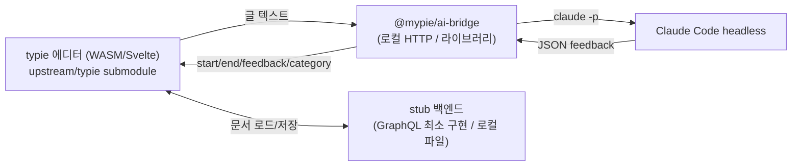

# mypie 아키텍처

## 목표

typie의 글쓰기 에디터를 그대로 쓰면서, AI 검사(첨삭/피드백)만 Claude Code headless로 구동하는 로컬 도구. 지금은 로컬 서버, 추후 데스크톱 앱(Tauri/Electron/Servo)으로 포장.

## typie 구조 실측 (왜 단순 import가 안 되는가)

upstream을 직접 뜯어본 결과(2개 층으로 나뉜다):

- **에디터 코어 = `@typie/editor-ffi`** (`crates/editor-ffi`, 16개 `editor-*` Rust crate → WASM). 이건 **깔끔한 패키지**다. `pkg/browser/{editor_ffi.js, editor_ffi_bg.wasm, icu.zst}`로 빌드되고 `Editor`/`EditorHost`를 직접 노출한다. ProseMirror/TipTap이 아니라 자체 CRDT + WebGL 렌더러. 편집·렌더·텍스트추출·하이라이트가 전부 WASM 안에서 로컬로 돈다(백엔드 불필요).
- **에디터 뷰 레이어 = 앱 내부 코드** (`apps/website/src/lib/editor-ffi/components/*.svelte` + `editor.svelte.ts` 래퍼). 이건 패키지가 아니고, `@typie/styled-system`(Panda), `@typie/ui`, 그리고 **`$mearie`(GraphQL)** 에 강결합돼 있다. View.svelte가 `createFragment`로 문서를 로드하므로 그대로 떼어 쓰면 mearie 런타임까지 끌려온다.

결론: 뷰 레이어를 재사용하려면 mearie/GraphQL이 딸려와 fork에 가까워진다. 대신 **WASM 코어(`@typie/editor-ffi`)를 직접 마운트**하면 fork 0, 의존성은 빌드된 WASM 패키지뿐이다(아래 "Phase 2 검증" 참고). mypie는 **submodule로 upstream을 참조**하고 그 위에 얇은 마운트 레이어만 얹는다.

## AI 검사 계약

typie의 검사는 `apps/api/src/graphql/resolvers/llm.ts`에 있다.

- OpenAI SDK → Cloudflare AI Gateway, **tool calling** `provide_feedback(start, end, feedback, category)`.
- GraphQL **subscription**으로 피드백을 스트리밍하고, `mapRange(start, end, ...)`로 `start`/`end` 텍스트 조각을 문서 범위에 매핑한다(범위 매칭 실패 시 Sentry 경고). 즉 `start`/`end`는 원문의 부분 문자열이다.
- 실제 프롬프트(검사 지침)는 소스가 아니라 DB(`Prompts` 테이블)에 있어 upstream 코드에서 추출 불가. mypie는 자체 한국어 교정 프롬프트를 쓴다.

mypie의 `@mypie/ai-bridge`는 이 계약을 그대로 따른다: 입력 텍스트 → Claude Code headless → `[{start, end, category, feedback}]`. 그래서 출력이 typie 에디터의 기존 range 매핑에 그대로 얹힌다.

## 컴포넌트

- **`@mypie/ai-bridge`** (동작): `claude -p --output-format json`을 spawn해 교정 피드백을 만든다. 의존성 없는 Node ESM. 라이브러리(`analyze`) + HTTP 서버(`POST /feedback`) + CLI.
- **stub 백엔드** (예정): typie 에디터가 요구하는 최소 GraphQL 표면(문서 로드/저장 등)만 구현하거나, 로컬 파일/localStorage로 대체. 인증/구독/요금제 게이트는 무력화. 이게 가장 불확실하고 큰 작업이다.
- **프론트엔드 통합** (예정): `upstream/typie`의 에디터 모듈을 빌드해 단일 로컬 문서를 띄우고, 검사 액션을 ai-bridge로 연결.

## Phase 2 검증 (WASM 빌드 + 직접 마운트)

실측으로 다음을 확인했다.

**WASM 코어는 로컬에서 빌드된다.** 외부 `wasm-pack`/`wasm-bindgen` 없이 typie 자체 `editor-bindgen`을 쓴다. 절차는 `scripts/build-editor-ffi.sh`에 박제(`cargo build --target wasm32 --features wasm-browser` → editor-bindgen → icu4x-datagen+zstd). 산출물: `editor_ffi.js`(76K), `editor_ffi_bg.wasm`(7.8M), `icu.zst`(2.2M). 빌드 ~2분. `pkg/`는 typie에서 gitignore되므로 fresh clone/CI에선 이 스크립트로 재생성해야 한다.

**뷰 레이어 없이 WASM을 직접 마운트할 수 있다(하드 블로커 없음).** 최소 시퀀스:
1. `createInstance(await WebAssembly.compileStreaming(fetch(wasmUrl)))` → `EditorHost.create(icuBytes)` (icu.zst 바이트를 그대로 전달, JS 압축해제 X — WASM이 내부 처리).
2. `host.create_editor_from_graph(new Uint8Array(), {width,height,scale_factor})` (빈 문서). 이어 `set_theme_variant('light-white')` + enqueue `{type:'system',event:{type:'theme_variant_changed'}}` + `{type:'system',event:{type:'initialize'}}`.
3. `page_sizes()`마다 `<canvas>` 생성 → `attach_surface(page, canvas, w, h, dpr)`. RAF 루프에서 `tick()` → `render_surface(page)`.
4. 입력: 숨김 textarea로 keydown/beforeinput/composition(한글 IME) → `enqueue({type:'key'|'insertion'|'text_input'...})`. 포인터: `enqueue({type:'selection', op:{type:'set_at', page, x, y}})`.

**검사 결선 = WASM 직접 호출.** `editor.prose_text()`로 평문 추출 → ai-bridge → 각 피드백의 텍스트 앵커를 `prose_text().indexOf(start)`로 prose offset(숫자)로 변환 → `editor.prose_to_selection(startOff, endOff)` → `enqueue({type:'tracked_range', op:{type:'set_group_decoration', group:'ai-feedback', ...}})` + `{op:{type:'add', id, group, selection}}`. **주의**: v2 에디터는 offset이 숫자이고 ai-bridge는 텍스트 앵커를 주므로, 이 indexOf 매핑(=upstream `mapRange` 대응)이 필요하다. 추후 ai-bridge에 offset 계산을 옮길 수 있다.

PoC: `apps/editor-poc` (Vite + Svelte 5, `@typie/editor-ffi/browser`만 의존, vite alias로 submodule의 빌드 산출물 참조).

### 브라우저 검증 결과 (headless Chrome)

확인됨:
- WASM 부팅, 빈 문단 문서 페이지 렌더(흰 페이지), 외부 의존성 0.
- 한글+영문 입력이 모델에 반영 — `prose_text()`가 입력 문자열과 일치. 단 캐럿은 클릭(`selection set_at`)으로 잡아야 하고, 타이핑은 `insertion/text`가 아니라 **`text_input`의 `replace_selection`** 이어야 한다(웹사이트 `ime-input-adapter`와 동일). init의 `set_flat(0,0)`만으론 편집 선택이 안 잡힌다.

폰트 프로토콜(규명):
- 기본 family는 **`Pretendard`**. 텍스트의 font_family가 미등록 family로 풀리면 글리프가 안 그려지고 `font_data_missing`도 안 나온다.
- `add_font_base(family, weight, bytes)`는 **zstd 압축 폰트 바이트**를 받는다(원시 .ttf는 `BadMagicNumber` zstd 오류). icu.zst와 동일.

렌더러(규명):
- **CPU 렌더러다.** `crates/editor-ffi/src/platform/wasm_browser.rs`: `RenderBackend::new_cpu` → `render_surface`가 `render_page`(CPU 래스터)로 픽셀 버퍼를 채우고 `present()`가 canvas **2D 컨텍스트에 `putImageData`**. WebGL/WebGPU 아님(`getContext('webgl2')`=null 정상). 즉 렌더는 headless 포함 어디서든 동작한다(GPU/RAF 이슈 아님).

**해결됨 — 글자 렌더링 동작 (전 과정 검증).** 막혔던 원인은 두 가지였고 둘 다 해결:
1. **폰트 서브셋**: typie 폰트는 glyf를 base에서 분리해 chunk로 전달하는 구조. 단순 전체 .ttf를 base로 넣으면 `font_registry.resolve`(`resolve.rs:103`)가 chunk-loaded 게이트를 못 넘어 **placeholder(624B, 글리프 없음)로 폴백** → 투명. 해결: `editor-ffi` **wasm-server 빌드의 `build_font`/`get_font_codepoints`**로 Pretendard를 정식 base+chunks+coverage로 가공(`scripts/build-font.mjs`), `set_fonts(coverage)` + `add_font_base` + 전 chunk `add_font_chunk`로 등록.
2. **기본 font_family 누락**: 스타일 없는 텍스트는 family NAME으로 resolve하는데 빈 문서 텍스트엔 font_family가 없어 미등록 family로 풀려 또 placeholder. 해결: `EMPTY_DOC` root modifiers에 `font_family=Pretendard` 부여 → 텍스트가 상속.
- 진단 키: selection highlight(폰트 무관)는 진작 그려졌고(opaque>0) 글리프만 0이었음 → 렌더 경로 OK, 폰트 resolve 문제로 좁혀짐. font_family를 명시 적용하니 dark(글리프) 픽셀 등장.

**검사 결선 = WASM 직접 호출 (검증됨).** `editor.prose_text()` → ai-bridge(`claude -p`) → 텍스트 앵커를 `prose_text().indexOf(start)`로 prose offset 변환(=upstream `mapRange` 대응) → `prose_to_selection` → `tracked_range` `set_group_decoration`(빨간 물결 밑줄) + `add`. 실제로 "각 고객사 별"에 밑줄 + 사이드바 카드(맞춤법) 표시 확인.

## 단계별 계획

1. **AI 브리지** — Claude Code headless 교정. (완료, `packages/ai-bridge`)
2. **에디터 부팅 PoC** — WASM 직접 마운트로 빈 문서 렌더 + 한글/영문 타이핑 + 검사 빨간밑줄/사이드바. (**완료, 전 과정 브라우저 검증**, `apps/editor-poc`) GraphQL stub 불필요, 폰트는 `build_font`로 가공.
3. **검사 결선 고도화** — 사이드바 양방향 동기화(hover/click), 스트리밍, 카테고리별 데코레이션, 폰트 lazy-load(현재 전 chunk eager).
4. **로컬 영속화** — 문서 저장/불러오기(CRDT graph 직렬화)를 로컬 파일/IndexedDB로.
5. **데스크톱 포장** — Tauri/Electron/Servo. ai-bridge와 마운트는 평범한 웹/Node라 그대로 임베드.

## 비결정/리스크

- typie 에디터를 website 앱과 분리해 띄우는 비용(2단계)이 미지수. 분리가 너무 비싸면 website 앱 전체를 stub 백엔드와 함께 띄우는 쪽으로 선회.
- Claude Code headless는 에이전트라 단발 추론보다 지연이 크다. 스트리밍 피드백 UX는 추후 `--output-format stream-json`으로 검토.
