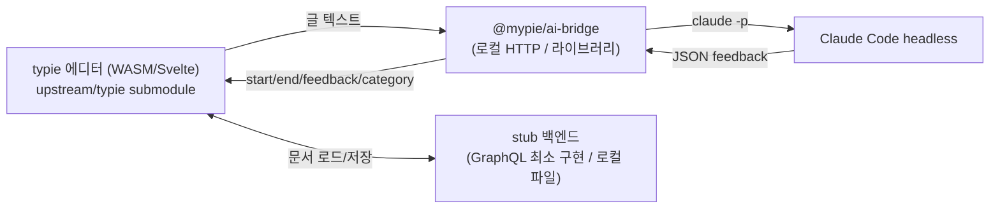

# mypie 아키텍처

## 목표

typie의 글쓰기 에디터를 그대로 쓰면서, AI 검사(첨삭/피드백)만 Claude Code headless로 구동하는 로컬 도구. 지금은 로컬 서버, 추후 데스크톱 앱(Tauri/Electron/Servo)으로 포장.

## typie 구조 실측 (왜 단순 import가 안 되는가)

upstream을 직접 뜯어본 결과:

- 에디터는 **Rust → WASM 기반 커스텀 에디터**다. `apps/website/src/lib/editor`, `editor-ffi`, `wasm.svelte.ts`로 구성되고 `crates/`의 Rust가 WASM으로 빌드된다. ProseMirror/TipTap 같은 npm 라이브러리가 아니다.
- 에디터는 별도 패키지가 아니라 `apps/website`(SvelteKit) 앱 안에 박혀 있다. `packages/`에는 `@typie/ui`(범용 컴포넌트), `@typie/lib` 등만 있고 에디터는 없다.
- 에디터/문서 화면은 GraphQL(`apps/api`, drizzle + PostgreSQL + BullMQ/Redis)에 전반적으로 강결합돼 있다. 인증, 문서 로드/저장, 구독이 모두 백엔드를 전제로 한다.

결론: "에디터 프론트엔드를 깔끔한 npm 의존성으로 가져오기"는 불가능에 가깝다. 그래서 mypie는 **submodule로 upstream을 참조**하고, 빌드 시 그 안의 모듈을 끌어다 쓰는 얇은 레이어 방식을 택한다(코드 복제 = fork 회피).

## AI 검사 계약

typie의 검사는 `apps/api/src/graphql/resolvers/llm.ts`에 있다.

- OpenAI SDK → Cloudflare AI Gateway, **tool calling** `provide_feedback(start, end, feedback, category)`.
- GraphQL **subscription**으로 피드백을 스트리밍하고, `mapRange(start, end, ...)`로 `start`/`end` 텍스트 조각을 문서 범위에 매핑한다(범위 매칭 실패 시 Sentry 경고). 즉 `start`/`end`는 원문의 부분 문자열이다.
- 실제 프롬프트(검사 지침)는 소스가 아니라 DB(`Prompts` 테이블)에 있어 upstream 코드에서 추출 불가. mypie는 자체 한국어 교정 프롬프트를 쓴다.

mypie의 `@mypie/ai-bridge`는 이 계약을 그대로 따른다: 입력 텍스트 → Claude Code headless → `[{start, end, category, feedback}]`. 그래서 출력이 typie 에디터의 기존 range 매핑에 그대로 얹힌다.

## 컴포넌트

- **`@mypie/ai-bridge`** (동작): `claude -p --output-format json`을 spawn해 교정 피드백을 만든다. 의존성 없는 Node ESM. 라이브러리(`analyze`) + HTTP 서버(`POST /feedback`) + CLI.
- **stub 백엔드** (예정): typie 에디터가 요구하는 최소 GraphQL 표면(문서 로드/저장 등)만 구현하거나, 로컬 파일/localStorage로 대체. 인증/구독/요금제 게이트는 무력화. 이게 가장 불확실하고 큰 작업이다.
- **프론트엔드 통합** (예정): `upstream/typie`의 에디터 모듈을 빌드해 단일 로컬 문서를 띄우고, 검사 액션을 ai-bridge로 연결.

## 단계별 계획

1. **AI 브리지** — Claude Code headless 교정. (완료, `packages/ai-bridge`)
2. **에디터 부팅 PoC** — upstream 에디터를 로컬에서 단일 문서로 띄우기. WASM 빌드 + GraphQL 의존 최소 stub 범위 측정.
3. **검사 결선** — 에디터의 피드백 UI(`FeedbackPopover`)를 ai-bridge에 연결, 빨간 밑줄 + 사이드바.
4. **로컬 영속화** — 문서 저장/불러오기를 로컬 파일로.
5. **데스크톱 포장** — Tauri/Electron/Servo. ai-bridge와 stub은 처음부터 평범한 Node/HTTP라 그대로 임베드 가능하게 유지.

## 비결정/리스크

- typie 에디터를 website 앱과 분리해 띄우는 비용(2단계)이 미지수. 분리가 너무 비싸면 website 앱 전체를 stub 백엔드와 함께 띄우는 쪽으로 선회.
- Claude Code headless는 에이전트라 단발 추론보다 지연이 크다. 스트리밍 피드백 UX는 추후 `--output-format stream-json`으로 검토.
